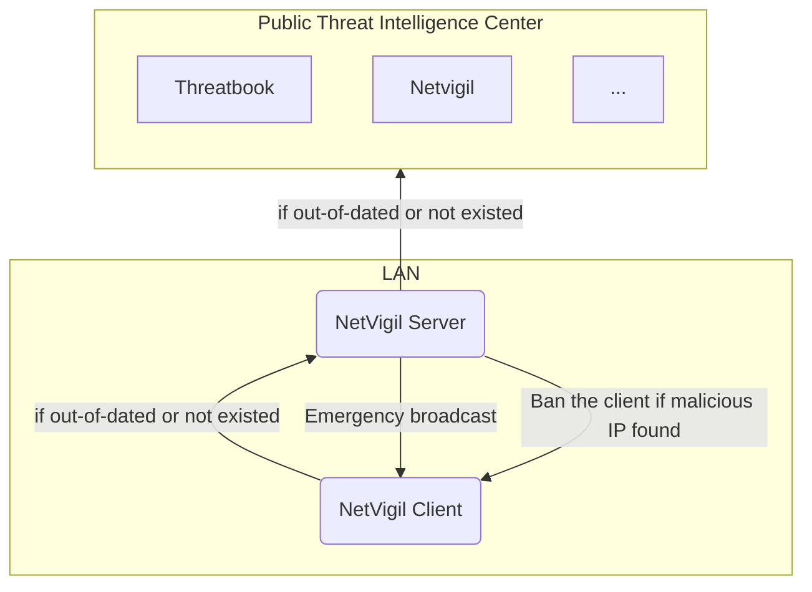

# NetVigil


Network Traffic Monitoring and Analysis based Local Threat Intelligence Center

## How to run

To compile this project, you need to install Node.js and Go in advance.

Firstly, build frontend resources

```bash
$ cd frontend
$ npm i
$ npm run build
```

Then, build go project

```bash
$ cd ..
$ go build .
```

In order to run the program correctly, you also need to provide a configuration file. You can directly rename `config.example.toml` to `config.toml` to use the default configuration.

## Workflow



## APIs

| Path            | Method | Request                | Response  | Description                |
| --------------- | ------ | ---------------------- | --------- | -------------------------- |
| `/api/login`    | POST   | `{username, password}` | Token     |                            |
| `/api/netstats` | GET    | `?limit&page`          | Netstat[] | Auth needed                |
| `/api/threats`  | GET    | `?limit&page`          | Threat[]  | Auth needed                |
| `/api/config`   | GET    |                        | Config    | Auth needed                |
| `/api/config`   | POST   | Config                 |           | Modify config, auth needed |
| `/api/check`    | POST   | `{apikey, ips}`        | Threat[]  | Check IP reputation        |

### Types

```go
type Netstat struct {
	ID         int64
	Time       int64  `json:"time"`
	LocalIP    string `json:"localIP"`
	LocalPort  uint16 `json:"localPort"`
	RemoteIP   string `json:"remoteIP"`
	RemotePort uint16 `json:"remotePort"`
	Executable string `json:"executable"`
	Location   string `json:"location"`
}
```

```go
type Threat struct {
	ID          int64
	Time        int64            `json:"time"`
	IP          string           `json:"ip"`
	TIC         string           `json:"tic"`      
	Reason      string           `json:"reason"`     
	Risk        RiskLevel        `json:"risk"`      
	Credibility CredibilityLevel `json:"credibility"`
}
```

## FAQs

* `invalid go version '1.21.6': must match format 1.23`

Upgrade your `go` version to at least `1.21.6`

* `Binary was compiled with 'CGO ENABLED=0', go-sqlite3 requires cgo to work. This is a stub`

Add `CGO_ENABLED=1` to your user environment variable. If env is correctly set, you will see `set CGO_ENABLED=1` with the fllowing command
```bash
$ go env
```

* `cgo: C compiler "gcc" not found: exec: "gcc": executable file not found in %PATH%`

Install `gcc` to fix it