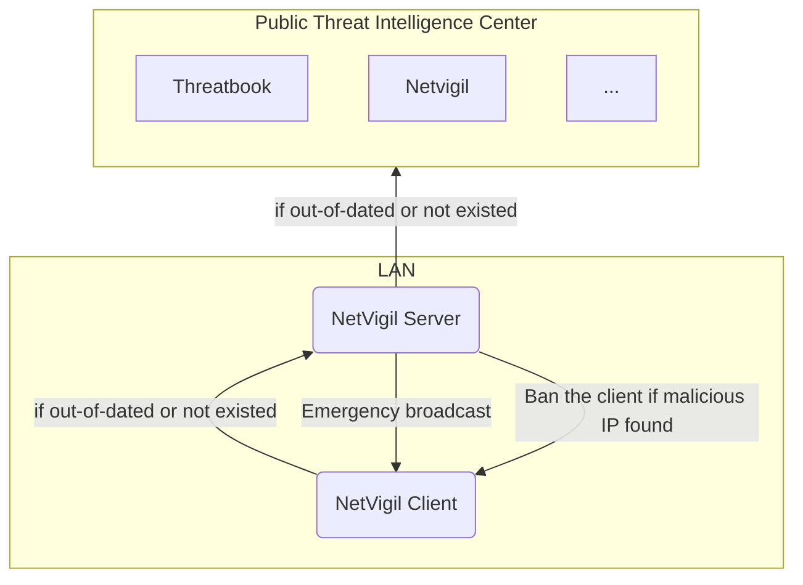

# NetVigil


Network Traffic Monitoring and Analysis based Local Threat Intelligence Center

## How to run

In order to run the program correctly, you need to create a `config.toml` file in the root directory, which should look like this:

```toml
# The period of checking for threats
check_period = '10s'

# The url of the web interface
# leave it empty if you don't want to use the web interface
web = '127.0.0.1:8080'

# Login credentials for the web interface
username = 'username'
password = 'password'

[[tic]]
type = 'local'

[[tic]]
type = 'netvigil'
server = 'example.com:8080'
apikey = 'your-api-key'

[[tic]]
type = 'threatbook'
apikey = 'your-api-key'

# You can add more TICs here
```

Here is all TICs you can use:

- `local`: Local Threat Intelligence Center
- `netvigil`: NetVigil, usually used for local network
- `threatbook`: [Threatbook](https://x.threatbook.cn/)
- `virustotal`: [VirusTotal](https://www.virustotal.com/)

In addition, you also need to provide a copy of `GeoLite2-City.mmdb` in the root directory, which you can find at [GeoLite2 Website](https://dev.maxmind.com/geoip/geolite2-free-geolocation-data).

After that, build frontend resources

```bash
# install pnpm first if you haven't: npm i -g pnpm
cd frontend
pnpm i
pnpm run build
```

Then, run go project

```bash
cd ..
go get
go build .
```

## Workflow



## APIs

| Path                   | Method | Request                | Response    | Description                            |
| ---------------------- | ------ | ---------------------- | ----------- | -------------------------------------- |
| `/api/login`           | POST   | `{username, password}` | Token       | Login Page                             |
| `/api/netstats`        | GET    | `?limit&page`          | Netstat[]   | Get network data, Auth needed          |
| `/api/threats`         | GET    | `?limit&page`          | Threat[]    | Get Threats ip, Auth needed            |
| `/api/threats`         | POST   | `{ip}`                 | Error or Ok | Add Threats ip, Auth needed            |
| `/api/threats/:ip`     | DELETE | `/ip`                  |             | Delete Threats ip, Auth needed         |
| `/api/clients`         | GET    |                        | Client[]    | Get user informaition, Auth needed     |
| `/api/clients`         | POST   | `{name}`               | Error or Ok | Add user, Auth needed                  |
| `/api/clients/:apikey` | DELETE | `/apikey`              | Error or Ok | Delete user, Auth needed               |
| `/api/config`          | GET    |                        | Config      | Get configuration, Auth needed         |
| `/api/config`          | POST   | Config                 |             | Modify config, auth needed             |
| `/api/check`           | POST   | `{apikey, ips}`        | Threat[]    | Check IP reputation                    |
| `/api/stats`           | GET    |                        | Index Data  | Get index data to display, auth needed |

### Types

```go
type Netstat struct {
	ID         int64
	Time       int64  `json:"time"`
	LocalIP    string `json:"localIP"`
	LocalPort  uint16 `json:"localPort"`
	RemoteIP   string `json:"remoteIP"`
	RemotePort uint16 `json:"remotePort"`
	Executable string `json:"executable"`
	Location   string `json:"location"`
}
```

```go
type Threat struct {
	ID          int64
	Time        int64            `json:"time"`
	IP          string           `json:"ip"`
	TIC         string           `json:"tic"`
	Reason      string           `json:"reason"`
	Risk        RiskLevel        `json:"risk"`
	Credibility CredibilityLevel `json:"credibility"`
}
```

```go
type Client struct {
	Name string `json:"name"`
	// Apikey is used in netvigil tic of `config.toml`
	Apikey string `json:"apikey"`
}
```

```go
type Statistics struct {
	Time                   time.Time
	RiskUnknownCount       int64 `json:"risk_unknown_count"`
	RiskSafeCount          int64 `json:"risk_safe_count"`
	RiskNormalCount        int64 `json:"risk_normal_count"`
	RiskSuspiciousCount    int64 `json:"risk_suspicious_count"`
	RiskMaliciousCount     int64 `json:"risk_malicious_count"`
	CredibilityLowCount    int64 `json:"credibility_low_count"`
	CredibilityMediumCount int64 `json:"credibility_medium_count"`
	CredibilityHighCount   int64 `json:"credibility_high_count"`
}
```


## FAQs

- `invalid go version '1.21.6': must match format 1.23`

  Upgrade your `go` version to at least `1.21.6`

- `Binary was compiled with 'CGO ENABLED=0', go-sqlite3 requires cgo to work. This is a stub`

  Add `CGO_ENABLED=1` to your user environment variable. If env is correctly set, you will see `set CGO_ENABLED=1` with the fllowing command

  ```bash
  $ go env
  ```

- `cgo: C compiler "gcc" not found: exec: "gcc": executable file not found in %PATH%`

  Install `gcc` to fix it

- `# github.com/google/gopacket/pcap`
  `../go/pkg/mod/github.com/google/gopacket@v1.1.19/pcap/pcap_unix.go:34:10: fatal error: pcap.h: No such file or directory`

  Run `apt-get install libpcap-dev` to solve it.
